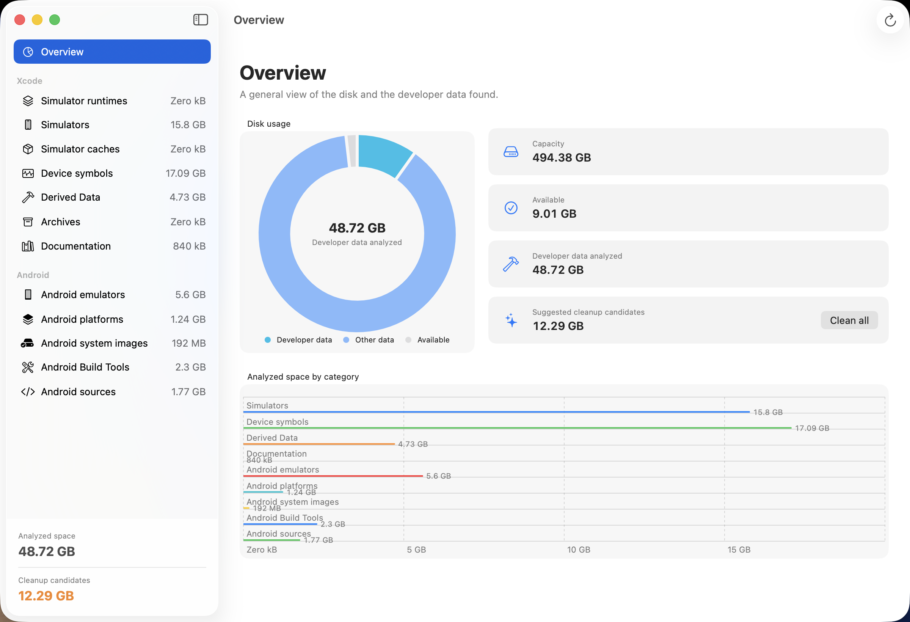
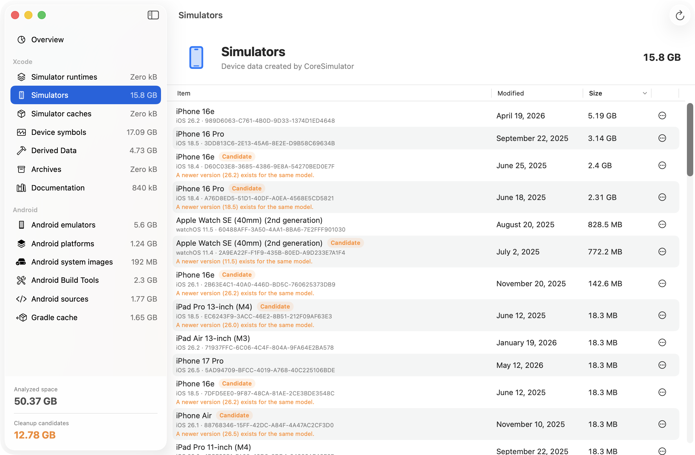
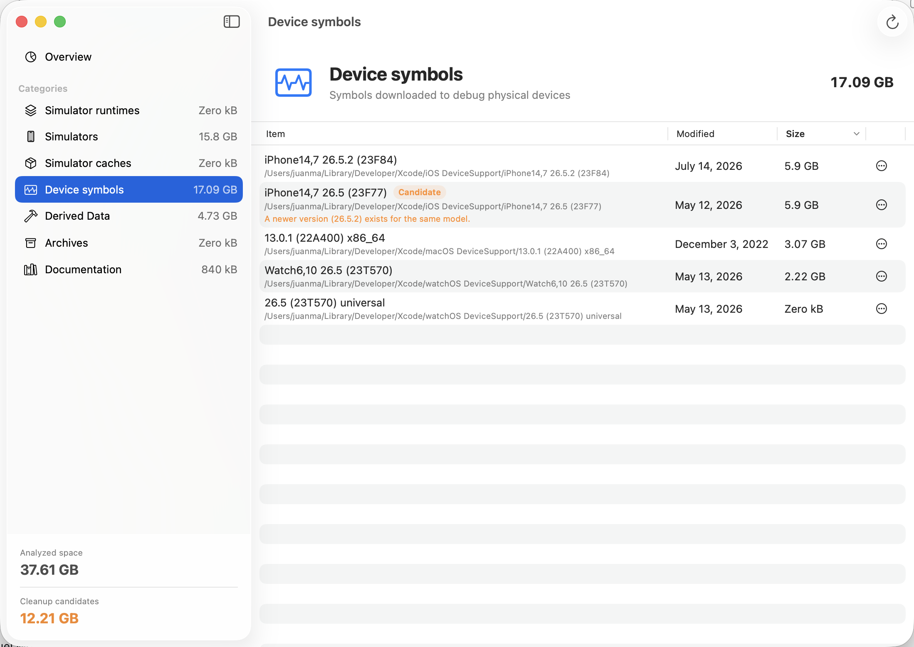
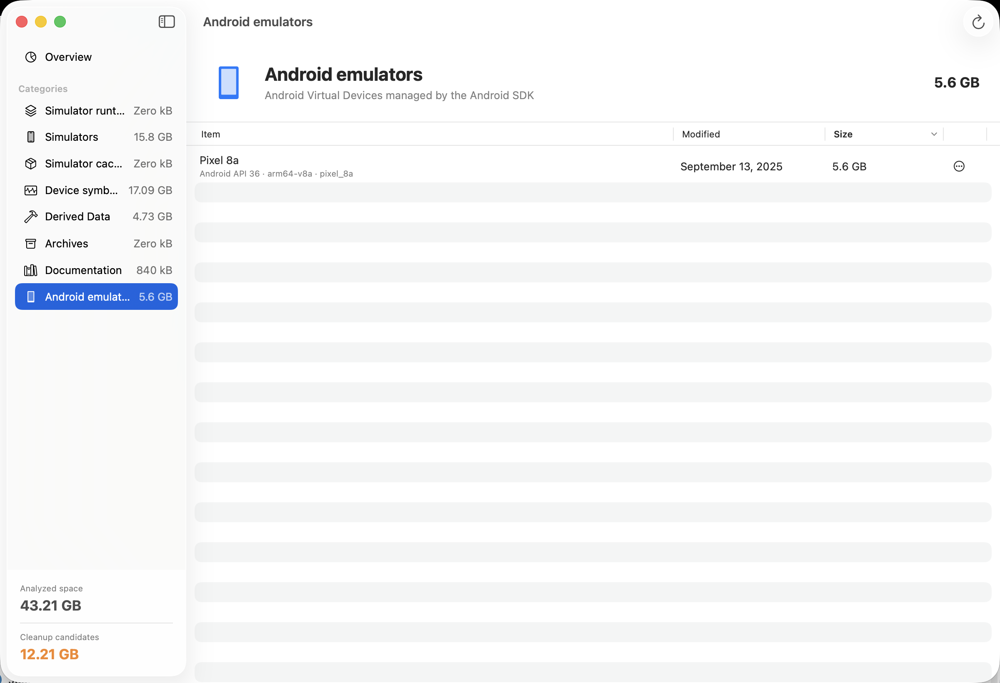
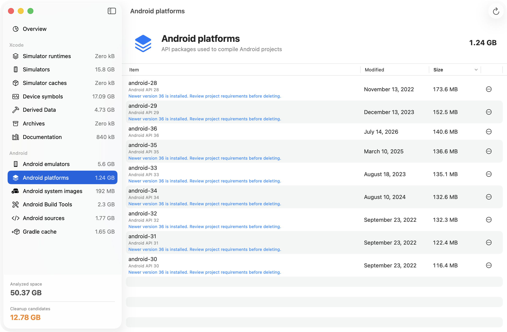
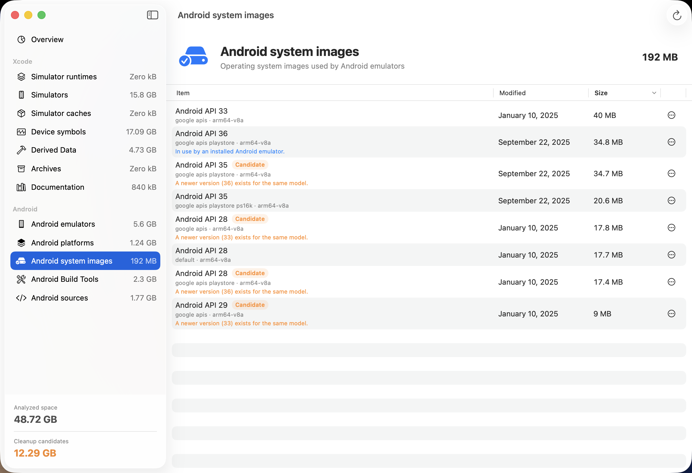
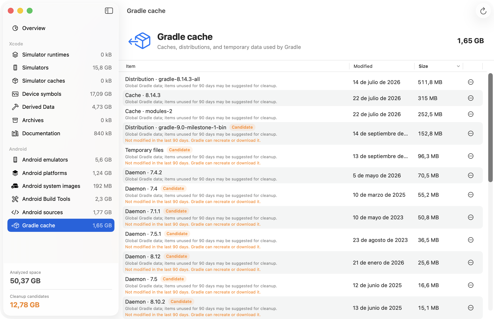

# Developer Storage Manager

A native macOS app to analyze, identify, and clean up storage used by Xcode and the Android SDK.

Developer Storage Manager explains where disk space is being used, recommends older simulator, device-symbol, and Android emulator versions as cleanup candidates, and always asks for confirmation before removing anything.

## Screenshots

### Overview



### Simulators



### Device Symbols



### Android Emulators



### Android SDK Versions





### Gradle Cache



## Features

- Disk usage overview across Xcode and Android development data.
- Simulator names and runtime versions instead of opaque UUIDs.
- Android Virtual Device names, API levels, architectures, sizes, and locations.
- Android Platforms, System Images, Build Tools, and Sources grouped by installed version.
- Gradle caches, wrapper distributions, daemon data, native components, and temporary files grouped into recoverable units.
- Conservative Gradle cleanup suggestions for data not modified in the last 90 days.
- Automatic Gradle cleanup lock while Gradle is running.
- Protection for system images currently used by an installed AVD.
- Conservative review notices for older SDK components that a project may still require.
- Cleanup recommendations that keep the newest version for each device model.
- Individual cleanup actions and bulk cleanup for suggested candidates.
- Finder integration for every scanned item.
- Recoverable cleanup through the Trash for user-managed Xcode data and Android Virtual Devices.
- Official `simctl` operations for simulator devices and runtimes.
- Automatic reanalysis after cleanup.
- English, Spanish, Portuguese, and French localization with automatic system-language selection and English fallback.

## Requirements

- macOS 15 or later.
- Xcode with the Swift 6.2 toolchain or later.
- Android Studio or the Android SDK is optional; installed AVDs are detected automatically.

## Run from source

```bash
swift run DeveloperStorageManager
```

You can also open `Package.swift` directly in Xcode.

## Build the macOS app

```bash
./Scripts/build-app.sh
open ".build/Developer Storage Manager.app"
```

The build script generates `AppIcon.icns` from `Assets/AppIcon.png`, creates the application bundle, and applies an ad hoc signature for local use.

## Build the DMG installer

```bash
./Scripts/build-dmg.sh
```

The installer is written to `.build/Developer Storage Manager.dmg`. It includes a custom background, a shortcut to Applications, and a custom Finder icon for the DMG file.

## Tests

```bash
swift test
```

## Safety

Every cleanup operation requires confirmation. User-managed files, Android Virtual Devices, and Android SDK packages are moved to the Trash, while Apple simulator devices and runtimes are removed through CoreSimulator. Cleanup is restricted to known paths under `~/Library/Developer`, `~/.android/avd`, and the detected Android SDK.

Bulk cleanup is intentionally conservative: it may suggest older, unused Android system images, but never Platforms, Build Tools, Sources, or images currently used by an AVD. Those components remain available for individual review and confirmed cleanup.

Gradle data is suggested only when none of its contents have been modified in the last 90 days. Cleanup is disabled while Gradle is running. Deleted Gradle data can be downloaded or recreated, but the next build may be slower and may require an Internet connection.

Please report security concerns according to [SECURITY.md](SECURITY.md).

## Contributing

Contributions are welcome. See [CONTRIBUTING.md](CONTRIBUTING.md) before opening a pull request.

## License

Developer Storage Manager is available under the [MIT License](LICENSE).

Copyright © 2026 Juan Manuel Mouriz.
